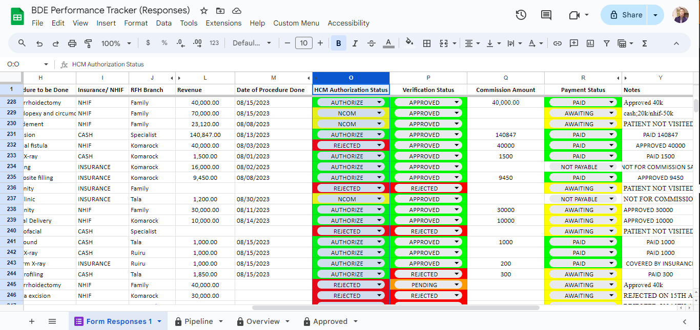
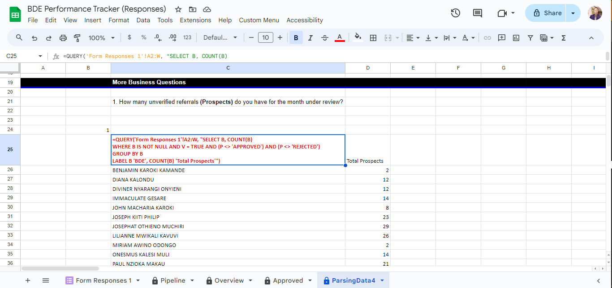

# BDE-Performance-Tracker
Managed Ruai Family Hospital's data from 10 branches for 8 months on Google Sheets. Used the QUERY function (a subset of SQL) &amp; formulas to analyze trends in performance, patient acquisition, and commissions. Insights drove decisions to prioritize surgeries with reliable insurance &amp; implement performance plans.

The project leveraged a custom AppSheet mobile app for efficient data collection from Business Development Executives across 10 branches. A Google Form provided a flexible alternative for those with limited storage. Data is parsed and analyzed using powerful QUERY functions and advanced Google Sheets formulas, enabling insightful dashboards tailored for each Business Development Executive.

Data Collection
===============

Data Parsing
============

Dashboards
==========

