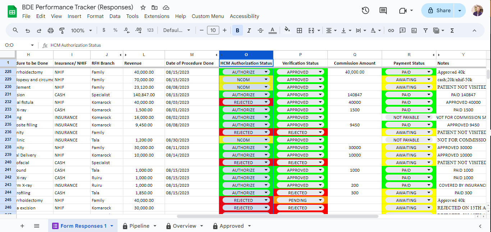
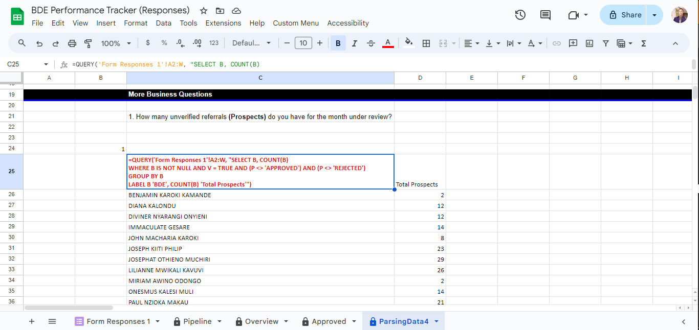
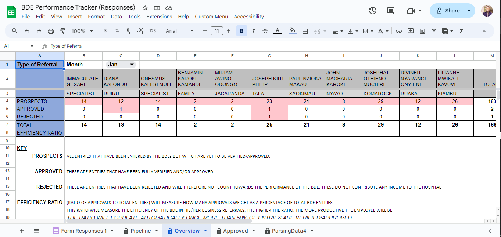

# BDE-Performance-Tracker

The project leveraged a custom AppSheet mobile app for efficient data collection from Business Development Executives across 10 branches. A Google Form provided a flexible alternative for those with limited storage. Data is parsed and analyzed using QUERY functions and advanced Google Sheets formulas, enabling insightful dashboards tailored for each Business Development Executive.

Data Collection
===============

Data Parsing
============

Code snippets available in src folder.

Dashboards
==========

